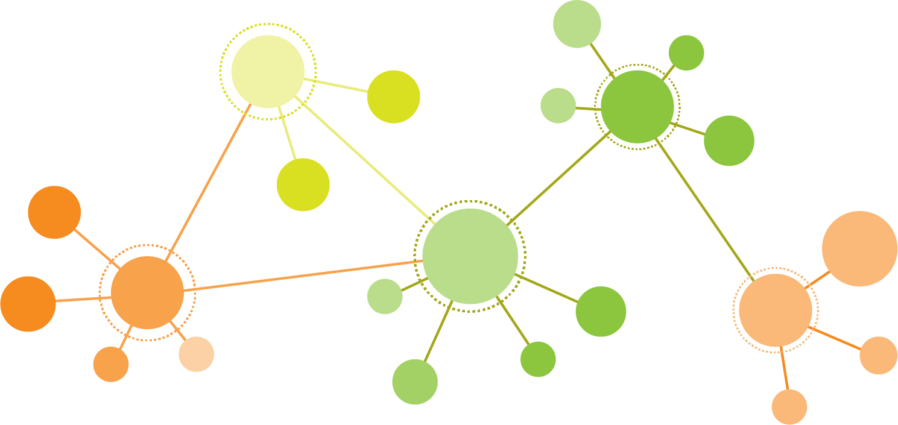

# amazon-networks


**WARNING: No longer up to date with Amazons website.**

 
 
Creates network graphs based on amazon "Customers who bought this item also bought" features.

**Political best sellers**
---

To what extent to readers of political literature balance their reading across the political spectrum?

<div class='tableauPlaceholder' id='viz1580599048927' style='position: relative'><noscript><a href='#'></a></noscript><object class='tableauViz'  style='display:none;'><param name='host_url' value='https%3A%2F%2Fpublic.tableau.com%2F' /> <param name='embed_code_version' value='3' /> <param name='site_root' value='' /><param name='name' value='GraphNetwork&#47;PoliticalBookNetwork' /><param name='tabs' value='no' /><param name='toolbar' value='yes' /><param name='static_image' value='https:&#47;&#47;public.tableau.com&#47;static&#47;images&#47;Gr&#47;GraphNetwork&#47;PoliticalBookNetwork&#47;1.png' /> <param name='animate_transition' value='yes' /><param name='display_static_image' value='yes' /><param name='display_spinner' value='yes' /><param name='display_overlay' value='yes' /><param name='display_count' value='yes' /></object></div>                <script type='text/javascript'>                    var divElement = document.getElementById('viz1580599048927');                    var vizElement = divElement.getElementsByTagName('object')[0];                    vizElement.style.width='100%';vizElement.style.height=(divElement.offsetWidth*0.75)+'px';                    var scriptElement = document.createElement('script');                    scriptElement.src = 'https://public.tableau.com/javascripts/api/viz_v1.js';                    vizElement.parentNode.insertBefore(scriptElement, vizElement);                </script>


**Prerequisites**
---

 + [pipenv](https://github.com/pypa/pipenv)
 + [ChromeDriver (added to PATH)](https://sites.google.com/a/chromium.org/chromedriver/home)


**Installation**
---

```
$ pipenv install
$ pipenv shell
```

**Run**
---

```
$ (amazon-networks) python amazon_network.py --help

usage: amazon_network.py [-h] [--amazon_url AMAZON_URL] [--graph GRAPH]

optional arguments:
  -h, --help            show this help message and exit
  --amazon_url AMAZON_URL
                        Enter an "Amazon Best Sellers" url
  --graph GRAPH         Enter output graph file name

```
