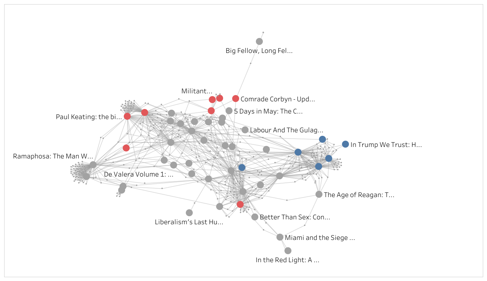

# amazon-networks


**WARNING: No longer up to date with Amazons website.**

 
 
Creates network graphs based on amazon "Customers who bought this item also bought" features.

**Political Best Sellers**
---

To what extent to readers of political literature balance their reading across the political spectrum?

[](https://public.tableau.com/views/GraphNetwork/PoliticalBookNetwork?:display_count=y&:origin=viz_share_link)
(click to open interactive dashboard)


**Prerequisites**
---

 + [pipenv](https://github.com/pypa/pipenv)
 + [ChromeDriver (added to PATH)](https://sites.google.com/a/chromium.org/chromedriver/home)


**Installation**
---

```
$ pipenv install
$ pipenv shell
```


**Run**
---

```
$ (amazon-networks) python amazon_network.py --help

usage: amazon_network.py [-h] [--amazon_url AMAZON_URL] [--graph GRAPH]

optional arguments:
  -h, --help            show this help message and exit
  --amazon_url AMAZON_URL
                        Enter an "Amazon Best Sellers" url
  --graph GRAPH         Enter output graph file name

```
